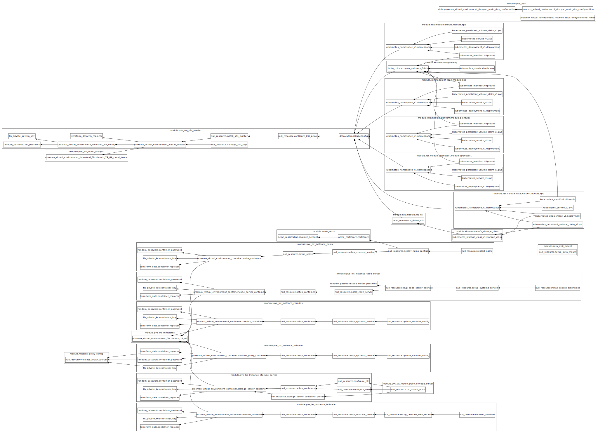

# Homelab Terraform

一个基于 Proxmox VE (PVE) 的家庭实验室基础设施即代码 (IaC) 一键部署方案。初始环境仅需一台运行 Proxmox VE 的服务器即可快速搭建完整的 Kubernetes 开发环境。

## ✨ 功能特性

- **🚀 一键部署**：通过 Terraform 自动化部署完整的基础设施
- **☸️ K3s 集群**：自动创建并配置 K3s 主节点，开箱即用的轻量级 Kubernetes
- **💻 Code Server**：基于 Web 的 VS Code 开发环境，随时随地编码
- **🌐 Mihomo 代理**：内置代理服务，加速容器镜像下载和网络访问
- **🗄️ 存储服务器**：支持 NFS 和 SMB 协议的存储服务
- **🔍 CoreDNS**：高性能 DNS 服务器，支持自定义 hosts 和缓存
- **📦 模块化设计**：可重用的 Terraform 模块，灵活组合使用
- **🔐 自动化安全配置**：自动生成 SSH 密钥和密码，安全管理

## 📋 前置要求

- [Proxmox VE](https://www.proxmox.com/en/proxmox-ve) 8.0+
- [Terraform](https://www.terraform.io/) >= 1.0
- 网络可访问 Proxmox VE API

## 📊 架构图



> Terraform 资源依赖关系图,展示各个模块之间的依赖关系和数据流向。

## 📁 项目结构

```text
.
├── all_in_one/           # 一键部署入口（推荐使用）
│   ├── code_server.tf    # Code Server LXC 容器配置
│   ├── coredns.tf        # CoreDNS LXC 容器配置
│   ├── k3s.tf            # K3s 主节点 VM 配置
│   ├── k8s.tf            # Kubernetes 应用配置
│   ├── locals.tf         # 公共配置（IP 地址、VM ID 等）
│   ├── mihomo.tf         # Mihomo 代理 LXC 容器配置
│   ├── pve_host.tf       # PVE 主机基础配置
│   ├── storage_server.tf # 存储服务器 LXC 容器配置
│   └── variables.tf      # 输入变量定义
├── pve/                  # Proxmox VE 模块
│   ├── common/           # PVE Provider 公共配置
│   ├── host_configure/   # PVE 主机配置（DNS、网络等）
│   ├── lxc_templates/    # LXC 容器模板下载
│   ├── lxcs/             # LXC 容器模块
│   │   ├── code_server/  # Code Server 容器
│   │   ├── coredns/      # CoreDNS DNS 服务容器
│   │   ├── mihomo_proxy/ # Mihomo 代理容器
│   │   └── storage_server/ # 存储服务器容器（NFS/SMB）
│   ├── vm_cloud_images/  # VM Cloud Image 下载
│   └── vms/              # 虚拟机模块
│       └── k3s_master/   # K3s 主节点虚拟机
├── k8s/                  # Kubernetes 相关模块
│   ├── all_in_one/       # K8s 一键部署入口
│   ├── common/           # K8s Provider 公共配置
│   ├── ingress-nginx/    # Ingress Nginx 控制器
│   ├── plantuml/         # PlantUML 服务
│   └── speedtest/        # Speedtest 测速服务
└── utils/                # 工具模块
    ├── mihomo_config_generator/  # Mihomo 配置生成器
    └── nginx_config_generator/   # Nginx 配置生成器
```

## 🚀 快速开始

### 1. 克隆仓库

```bash
git clone https://github.com/zhangzqs/homelab-terraform.git
cd homelab-terraform/all_in_one
```

### 2. 配置变量

创建 `terraform.tfvars` 文件：

```hcl
# Proxmox VE 配置
pve_endpoint = "https://your-pve-host:8006"
pve_password = "your-pve-password"

# 可选：Mihomo 代理配置
mihomo_proxy_vars = {
  proxy_providers = {
    "provider1" = {
      url = "https://your-subscription-url"
    }
  }
  custom_proxies = {}
}
```

### 3. 初始化并部署

```bash
# 初始化 Terraform
terraform init

# 预览变更
terraform plan

# 执行部署
terraform apply
```

### 4. 获取访问信息

```bash
# 获取 K3s kubeconfig
terraform output -raw kubeconfig > kubeconfig.yaml
export KUBECONFIG=$(pwd)/kubeconfig.yaml
kubectl get nodes

# 获取 K3s 主节点 SSH 私钥
terraform output -raw k3s_master_private_key > k3s_key.pem
chmod 600 k3s_key.pem

# 获取各服务 IP 地址和密码
terraform output
```

## 📊 资源分配

| 资源名称       | 类型 | VM ID | IP 地址         |
| -------------- | ---- | ----- | --------------- |
| Mihomo Proxy   | LXC  | 200   | 192.168.242.200 |
| Code Server    | LXC  | 201   | 192.168.242.201 |
| K3s Master     | VM   | 202   | 192.168.242.202 |
| Storage Server | LXC  | 203   | 192.168.242.203 |
| CoreDNS        | LXC  | 204   | 192.168.242.204 |

> **注意**：IP 地址和 VM ID 可以在 `all_in_one/locals.tf` 中自定义修改。

## ⚙️ 配置变量

### 必需变量

| 变量名         | 类型   | 说明                                                        |
| -------------- | ------ | ----------------------------------------------------------- |
| `pve_endpoint` | string | Proxmox VE API 端点 URL（如：`https://192.168.1.100:8006`） |
| `pve_password` | string | Proxmox VE root 用户密码                                    |

### 可选变量

| 变量名              | 类型   | 默认值 | 说明                                    |
| ------------------- | ------ | ------ | --------------------------------------- |
| `mihomo_proxy_vars` | object | `{}`   | Mihomo 代理配置，包含订阅源和自定义代理 |

## 🔧 高级用法

### 单独使用模块

如果只需要部署特定组件，可以单独引用相应模块：

```hcl
# 仅部署 K3s Master
module "k3s_master" {
  source = "github.com/zhangzqs/homelab-terraform//pve/vms/k3s_master"

  pve_node_name         = "pve"
  pve_endpoint          = "https://your-pve-host:8006"
  pve_username          = "root@pam"
  pve_password          = "your-password"

  vm_id                    = 200
  ubuntu_cloud_image_id    = "local:iso/ubuntu-24.04-cloudimg-amd64.img"
  network_interface_bridge = "vmbr0"
  ipv4_address             = "192.168.1.100"
  ipv4_address_cidr        = 24
  ipv4_gateway             = "192.168.1.1"
}
```

### 自定义网络配置

在 `all_in_one/locals.tf` 中修改网络配置：

```hcl
locals {
  pve_default_network_bridge = "vmbr0"          # 网络桥接设备
  pve_default_ipv4_gateway   = "192.168.242.1"  # 默认网关

  # 自定义 IP 地址
  pve_ipv4_address_lxc_mihomo_proxy = "192.168.242.200"
  pve_ipv4_address_lxc_code_server  = "192.168.242.201"
  pve_ipv4_address_vm_k3s_master    = "192.168.242.202"
}
```

## 🗑️ 销毁环境

```bash
cd all_in_one
terraform destroy
```

## 📈 代码统计

<!-- tokei-start -->
```
===============================================================================
 Language            Files        Lines         Code     Comments       Blanks
===============================================================================
 HCL                   107         6363         5131          369          863
 Pan                    17         1078          797          118          163
 Shell                  15          978          638          156          184
 SVG                     1         1323         1120          203            0
-------------------------------------------------------------------------------
 Markdown                8         1082            0          762          320
 |- BASH                 6          206          106           65           35
 |- HCL                  8          494          383           50           61
 |- YAML                 1            6            6            0            0
 (Total)                           1788          495          877          416
===============================================================================
 Total                 148        10824         7686         1608         1530
===============================================================================
```
<!-- tokei-end -->

## 🧪 集成测试 (CI)

本项目提供了一个基于 GitHub Actions 的集成测试工作流，可以使用 QEMU-KVM 在 CI 环境中自动启动一个 Proxmox VE 虚拟机，并针对该虚拟机运行 Terraform 部署测试。

### 工作流特性

- **自动化 PVE 安装**：使用 Proxmox VE 自动安装器 (PVE 8.1+) 进行无人值守安装
- **QEMU-KVM 虚拟化**：支持 KVM 加速（如果可用），否则回退到 TCG 模拟
- **完整测试流程**：包括 Terraform init、validate 和 plan 测试
- **可选 apply 测试**：可以选择性地执行完整的 Terraform apply

### 手动触发测试

1. 进入 GitHub 仓库的 **Actions** 页面
2. 选择 **PVE Integration Test** 工作流
3. 点击 **Run workflow**
4. 可选配置：
   - `pve_version`：指定 PVE 版本（默认 9.1-1）
   - `skip_terraform_apply`：是否跳过 terraform apply（默认 true）

### 本地运行（需要 Linux + KVM）

```bash
# 安装依赖
sudo apt-get install qemu-system-x86 qemu-utils ovmf

# 参考 .github/workflows/integration-test.yml 中的步骤
```

### 注意事项

- 此工作流资源密集，完整运行可能需要 30-60 分钟
- 建议仅在需要时手动触发，而不是在每次 PR 时运行
- 日志和测试结果会作为 Artifacts 上传，保留 14 天

## 📄 许可证

本项目采用 [MIT License](LICENSE) 开源协议。

## 🤝 贡献

欢迎提交 Issue 和 Pull Request！

## ⚠️ 注意事项

1. **安全提醒**：`terraform.tfvars` 包含敏感信息，请勿提交到版本控制系统
2. **网络配置**：确保 IP 地址与您的网络环境匹配，避免 IP 冲突
3. **存储要求**：确保 Proxmox VE 的 `local` 存储支持 `snippets` 类型
4. **代理配置**：K3s 容器镜像下载默认通过 Mihomo 代理加速
